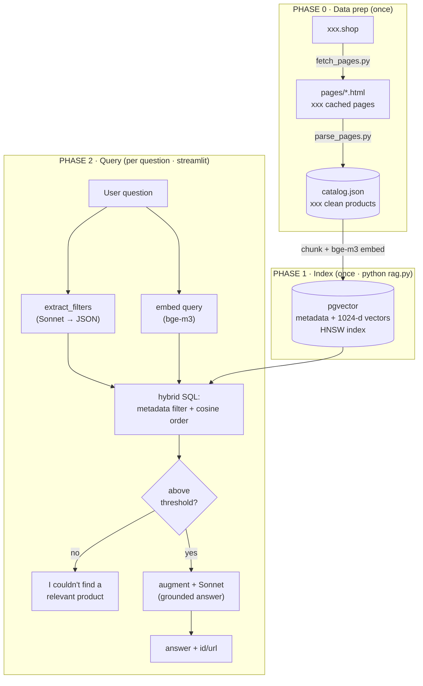
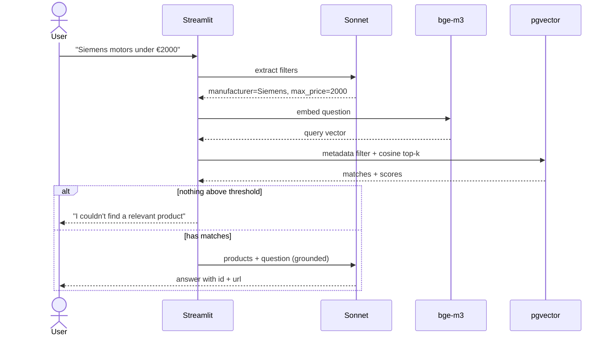

<div align="center">

# 🔧 Industrial Product RAG

A grounded Retrieval-Augmented Generation system over a catalog of **industrial products**. Ask in natural language, get answers **only** from
the catalog — the assistant refuses anything it can't back with a real product.

<p>
  
  
  
  
  
  
</p>

</div>

---

## ✨ Highlights

- **Hybrid retrieval** — structured metadata filters (manufacturer / price / weight / category) **+**
  semantic vector search, in a single SQL query.
- **Grounded by design** — two guardrails against hallucination: a similarity threshold that
  short-circuits before the LLM is even called, and a system prompt locking the model to the
  retrieved products.
- **Free, local embeddings** — `bge-m3` runs on your machine (no embedding API key, multilingual).
- **Transparent** — the UI shows the extracted filters, the retrieved products with scores, and the
  exact prompt sent to the model.
- **Reproducible data pipeline** — the catalog is built from raw collected pages, fully re-runnable.

---

## 🗺️ Architecture



**Two phases:** an **offline** part (collect → clean → embed → index) built once, and an **online**
part (filter → search → threshold → answer) that runs per question.

---

## 🧠 How a query flows



---

## 📦 Project structure

```
industrial-rag/
├── app.py               # Streamlit chat UI (shows retrieval + prompt)
├── rag.py               # RAG core: build_index · retrieve · answer
├── catalog.json         # cleaned products (the dataset)
├── pages/               # cached product HTML pages (with embedded meta header)
├── Dockerfile           # app image (Streamlit + RAG, CPU torch)
├── docker-compose.yml   # db (pgvector) + app (Streamlit) services
├── .dockerignore
├── requirements.txt
├── .streamlit/
│   └── config.toml      # disable telemetry; render through port-forward/proxy
├── LICENSE
└── scripts/             # data-prep pipeline (how catalog.json was built)
    ├── collect_shop.py  # collector library: collect_links, parse_product
    ├── fetch_pages.py   # stage 1: listing pages → product HTML in pages/
    └── parse_pages.py   # stage 2: pages/*.html → catalog.json
```

---

## 🚀 Quickstart

> Requires Docker only — the app and Postgres both run in containers. First index build downloads
> `bge-m3` (~2.3 GB) once.


**Run it** (after creating `.env`):

```bash
docker compose up -d --build && docker compose exec app python rag.py
```


Open <http://localhost:8501>.

---

## 💬 Usage

| Try asking… | What happens |
|---|---|
| `vacuum pumps over 300 kg` | weight filter + semantic match |
| `Siemens motors under €2000` | manufacturer + price filter |
| `oil-less packaging vacuum pump` | pure semantic match |
| `VTLF 2.250/0-79.1` | exact part lookup |
| `hydraulic excavator` | **refused** — not in catalog |
| `write me a poem` | **refused** — off-topic |

Every answer comes with two expanders: **🔎 retrieval details** (filters + scored products) and
**📝 the exact prompt** sent to Claude — so you can see exactly what the RAG did.

---

## ⚙️ How it works (the 9 stages)

| # | Stage | What | Where |
|---|---|---|---|
| 1 | Chunk | one product = one combined text blob | `product_text` |
| 2 | Embed | bge-m3 → 1024-d normalized vector | `embed` |
| 3 | Index | write metadata + vector to pgvector, HNSW | `build_index` |
| 4 | Filter extract | Sonnet pulls structured filters from the query | `extract_filters` |
| 5 | Query embed | same model embeds the question | `retrieve` |
| 6 | Retrieve | SQL: metadata filter + cosine order, top-k | `retrieve` |
| 7 | Threshold | drop weak matches; empty → skip the LLM | `retrieve` / `answer` |
| 8 | Augment | render products into the prompt | `build_prompt` |
| 9 | Generate | Sonnet answers, grounded to those products | `answer` |

<details>
<summary><b>Why these choices?</b></summary>

- **bge-m3 (local)** — free, no embedding API key, multilingual. 1024 dims fits comfortably under
  pgvector's 2000-dim HNSW limit.
- **pgvector** — metadata filters and vector search live in the same store, so hybrid retrieval is
  one SQL statement instead of two systems to reconcile.
- **Hybrid over pure semantic** — product descriptions are templated and look alike; metadata
  filters (brand, price, weight) do the heavy lifting, semantics handles the fuzzy part.
- **Threshold short-circuit** — the strongest grounding guarantee: if nothing clears the bar, the
  model is never called, so it can't invent an answer.

</details>

---

## 🔧 Tuning & troubleshooting

| Symptom | Fix |
|---|---|
| Everything returns "not found" | lower `MIN_SIM` in `rag.py`, then `docker compose restart app` |
| Irrelevant results slip through | raise `MIN_SIM`, then `docker compose restart app` |
| "Index not built yet" shown in the app | run `docker compose exec app python rag.py` |
| `connection refused` to the DB | DB still starting — `docker compose ps`; the app reaches it at host `db` |
| Slow first run | one-time `bge-m3` download + CPU embedding; later runs are fast |

---

## License

This project is licensed under the MIT License — see the [LICENSE](LICENSE) file for details.
